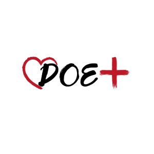

# Projeto Integrador   Curso de Introdução à Programação com foco em Front-End   Proz Educação - Portal Tech 

### Turma: 11 - Grupo: A - Professor: Randerson Melville.

**O Portal Tech é um programa criado pela AWS e pela Meta para abrir um portal de acesso ao conhecimento sobre algumas das tecnologias que mais crescem no mundo: computação em nuvem, metaverso e marketing digital.**

  
  
  
  

### Este repositório contém arquivos criados com a finalidade de cumprimento do Projeto de Conclusão de Curso.

## Tecnologias Utilizadas:

  
  
  
  
  
  

## Nome do site: DOE+

## Informações: 

### Objetivo:

O projeto DOE+ foi criado para unir comunidades e pessoas transmitindo esperança em forma de doações de roupas. O nosso projeto consiste em conectar pessoas que podem doar, mas, não sabem a quem e pessoas que necessitam de doações e não sabem onde encontrar.

A ideia surgiu quando seus organizadores, que moram em diferentes localidades do país, perceberam em suas vivências a falta de conexão entre as pessoas doadoras e as receptoras. 

Nesse sentido, o nosso objetivo é resolver este problema conectando pessoas através de ações de solidariedade, promovendo assim, dignidade e bem estar social.

### Organizadores:

  Foto | Nome | Github | Linkedin 
  |:-----:|:------:|:--------:|:----------:|
| **Matheus Monteiro** | ||
| **Rodrigo Oliveira** |||
| **João Sales** |||

### Funcionalidades:

 * Cadastro de usuários que desejam doar ou receber.
 
 * Anúncio dos itens a serem doados.
 
 * Pesquisa de itens por cidade para facilitar a busca e troca de itens.
 
 * Chat para contato entre doadores e receptores.

### Públicos Alvo: 

* Pessoas que desejam realizar doações de roupas e não sabem onde ou a quem doar.

* Pessoas que desejam receber doações de roupas e não sabem onde ou a quem recorrer.

### Link do site: 
**Projeto ainda em construção, mas, você pode conferir em:**

### Agradecimentos:
* [Proz - Educação](https://prozeducacao.com.br/);

* [Portal Tech](https://www.portaltechs.com/);
  
* [AWS](https://aws.amazon.com/pt/?nc2=h_lg);

* [META](https://about.meta.com/br/);

* [Professor Rand](https://github.com/RandMelville);

    

